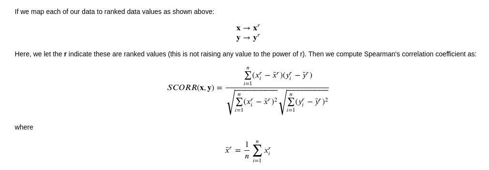
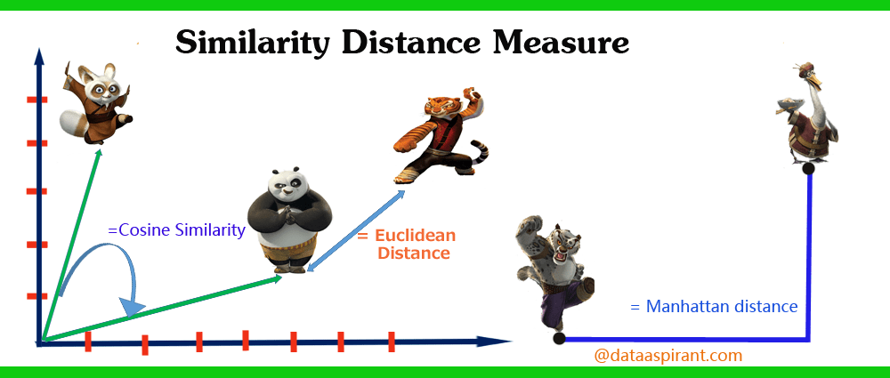
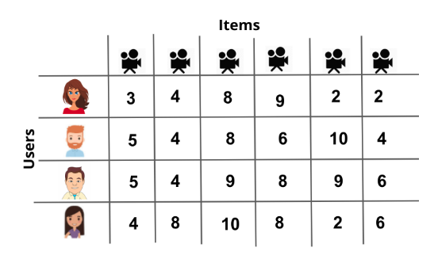
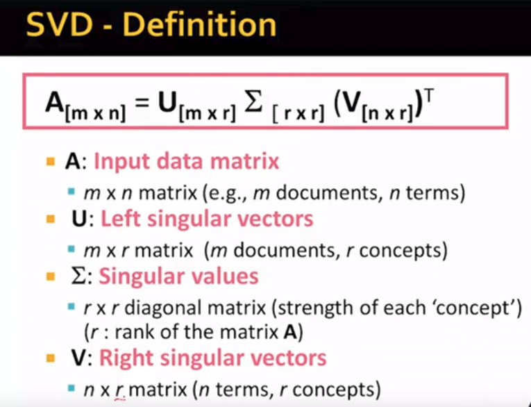
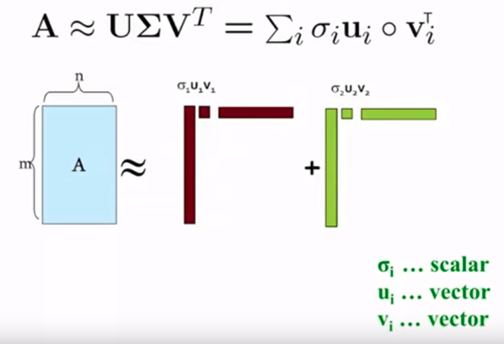
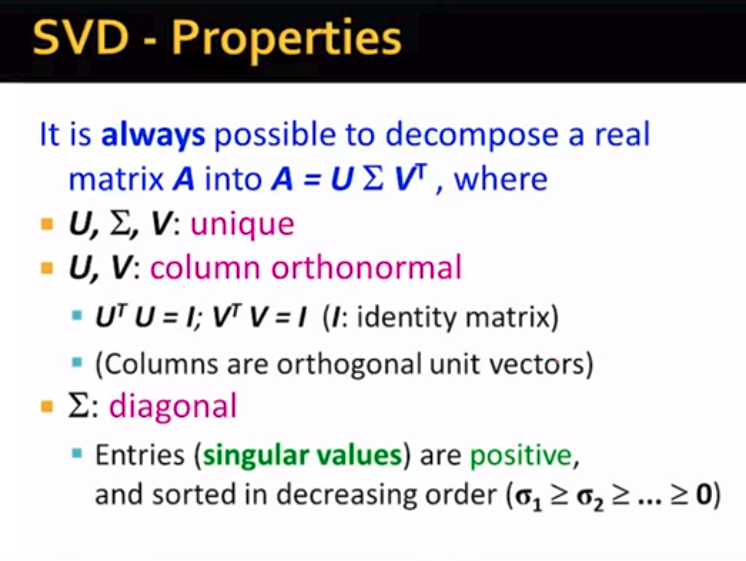
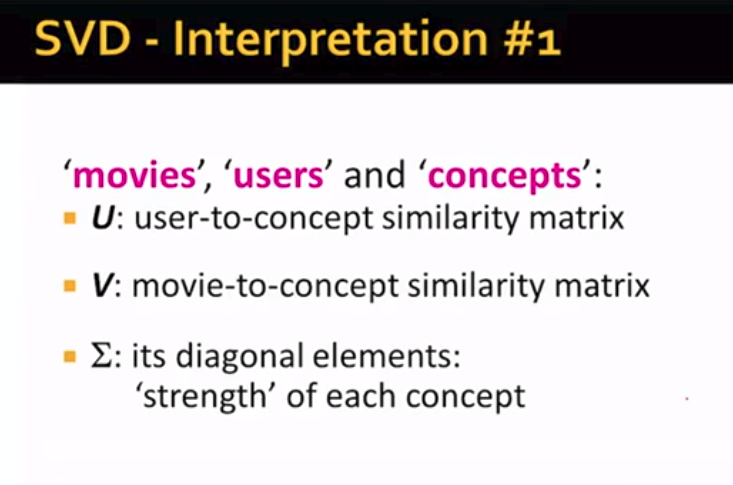

# Recommendation Engines

### Types of Recommendations

- Knowledge Based Recommendations
- Collaborative Filtering Based Recommendations
- Content Based Recommendations


Within __Collaborative Filtering__, there are two main branches:

- Model Based Collaborative Filtering
- Neighborhood Based Collaborative Filtering


### Similarity Metrics

In order to implement Neighborhood Based Collaborative Filtering, you will learn about some common ways to measure the similarity between two users (or two items) including:

- Pearson's correlation coefficient
- Spearman's correlation coefficient
- Kendall's Tau
- Euclidean Distance
- Manhattan Distance

You will learn why sometimes one metric works better than another by looking at a specific situation where one metric provides more information than another.

### Business Cases For Recommendations

- Relevance
- Novelty
- Serendipity
- Increased Diversity


## Distances and Similarities

### Pearson's Correlation

**Pearson's correlation coefficient** is a measure related to the strength and direction of a **linear** relationship. 

If we have two vectors x and y, we can compare their individual elements in the following way to calculate Pearson's correlation coefficient:


Examples:

- If when x increases, y always increases, Pearson's correlation will be always be 1: False
- If when x increases by 1, y always increases by 3, Pearson's correlation will always be 1: True
- If when x increases by 1, y always decreases by 5, Pearson's correlation will always be -1: True
- If when x increases by 1, y increases by 3 times x, Pearson's correlation will always be 1: False

Pearson's correlation relates to a linear relationship.  The second and third cases are examples of perfect linear relationships, where we would receive values of 1 and -1.  Only having an increase or decrease that are directly related will not lead to a Pearson's correlation coefficient of 1 or -1.  You can see this by testing out your function using the examples above without using assert statements.


### Spearman's Correlation

Now, let's look at **Spearman's correlation coefficient**. Spearman's correlation is what is known as a [non-parametric](https://en.wikipedia.org/wiki/Nonparametric_statistics) statistic, which is a statistic whose distribution doesn't depend on parameters. (Statistics that follow normal distributions or binomial distributions are examples of parametric statistics.)  

Frequently non-parametric statistics are based on the ranks of data rather than the original values collected.  This happens to be the case with Spearman's correlation coefficient, which is calculated similarly to Pearson's correlation.  However, instead of using the raw data, we use the rank of each value.

You can quickly change from the raw data to the ranks using the **.rank()** method in numpy.

```python
data = [5, 7, 1, 22, 3, 21, 55]
np.array(data.rank())
```




### Kendall's Tau

Kendall's tau is quite similar to Spearman's correlation coefficient.  Both of these measures are non-parametric measures of a relationship.  Specifically both Spearman and Kendall's coefficients are calculated based on ranking data and not the raw data.  

Similar to both of the previous measures, Kendall's Tau is always between -1 and 1, where -1 suggests a strong, negative relationship between two variables and 1 suggests a strong, positive relationship between two variables.

Though Spearman's and Kendall's measures are very similar, there are statistical advantages to choosing Kendall's measure in that Kendall's Tau has smaller variability when using larger sample sizes.  However Spearman's measure is more computationally efficient, as Kendall's Tau is O(n^2) and Spearman's correlation is O(nLog(n)). You can find more on this topic in [this thread](https://www.researchgate.net/post/Does_Spearmans_rho_have_any_advantage_over_Kendalls_tau).

Let's take a closer look at exactly how this measure is calculated.  Again, we want to map our data to ranks:


### Distance Measures

Each of the above measures are considered measures of correlation.  Similarly, there are distance measures (of which there are many).  [This is a great article](http://dataaspirant.com/2015/04/11/five-most-popular-similarity-measures-implementation-in-python/) on some popular distance metrics.  In this notebook, we will be looking specifically at two of these measures.  

1. Euclidean Distance
2. Manhattan Distance

Different than the three measures you built functions for, these two measures take on values between 0 and potentially infinity.  Measures that are closer to 0 imply that two vectors are more similar to one another.  The larger these values become, the more dissimilar two vectors are to one another.

Choosing one of these two `distance` metrics vs. one of the three `similarity` above is often a matter of personal preference, audience, and data specificities.  You will see in a bit a case where one of these measures (euclidean or manhattan distance) is optimal to using Pearson's correlation coefficient.


### Euclidean Distance

Euclidean distance can also just be considered as straight-line distance between two vectors.

For two vectors **x** and **y**, we can compute this as:


### Manhattan Distance

Different from euclidean distance, Manhattan distance is a 'manhattan block' distance from one vector to another.  Therefore, you can imagine this distance as a way to compute the distance between two points when you are not able to go through buildings.

Specifically, this distance is computed as:


Using each of the above, write a function for each to take two vectors and compute the euclidean and manhattan distances.




You can see in the above image, the **blue** line gives the **Manhattan** distance, while the **green** line gives the **Euclidean** distance between two points.

#### [READ MORE about distances](http://dataaspirant.com/2015/04/11/five-most-popular-similarity-measures-implementation-in-python/)


## Collaborative Filtering

In collaborative filtering, you are using the collaboration of user-item recommendations to assist in making new recommendations.  

There are two main methods of performing collaborative filtering:

1. **Neighborhood-Based Collaborative Filtering**, which is based on the idea that we can either correlate items that are similar to provide recommendations or we can correlate users to one another to provide recommendations.

2. **Model Based Collaborative Filtering**, which is based on the idea that we can use machine learning and other mathematical models to understand the relationships that exist amongst items and users to predict ratings and provide ratings.


In this notebook, you will be working on performing **neighborhood-based collaborative filtering**.  There are two main methods for performing collaborative filtering:

1. **User-based collaborative filtering:** In this type of recommendation, users related to the user you would like to make recommendations for are used to create a recommendation.

2. **Item-based collaborative filtering:** In this type of recommendation, first you need to find the items that are most related to each other item (based on similar ratings).  Then you can use the ratings of an individual on those similar items to understand if a user will like the new item.


# Validating Recommendations

### Online Testing

For online methods of testing a recommender's performance, many of the methods you saw in the previous lesson work very well - you can deploy your recommendations and just watch your metrics carefully. It is common in practice to set up online recommendations to have an "old" version of recommended items, which is compared to a new page that uses a new recommendation strategy.

All ideas associated with A/B testing are critical to watching your metrics in online learning, and ultimately, choosing a recommendation strategy that works best for your products and customers.

### Offline Testing

In many cases, a company might not let you simply deploy your recommendations out into the real world any time you feel like it. Testing out your recommendations in a training-testing environment prior to deploying them is called offline testing.

The recommendation methods you built in the previous lesson actually don't work very well for offline testing. In offline testing, it is ideal to not just obtain a list of recommendations for each individual, because we ultimately don't know if a user doesn't use an item because they don't like it, or because they just haven't used it yet (but would like it). Rather, it would be great if we have an idea of how much each user would like each item using a predicted rating. Then we can compare this predicted rating to the actual rating any individual gives to an item in the future.

In the previous video, you saw an example of a user to whom we gave a list of movies that they still hadn't seen. Therefore, we couldn't tell how well we were doing with our recommendations. Techniques related to matrix factorization lend themselves nicely to solving this problem.

### User Groups

The final (possible) method of validating your recommendations is by having user groups give feedback on items you would recommend for them. Obtaining good user groups that are representative of your customers can be a challenge on its own. This is especially true when you have a lot of products and a very large consumer base.


## Latent Factors

Latent factors are information that is not available directly in the data but can be deduced.

Ex: a movie which has a canadian actor.

When performing __SVD__ (Single Value Decomposition), we create a matrix of users by items (or customers by movies in our specific example), with user ratings for each item scattered throughout the matrix. An example is shown in the image below.



You can see that this matrix doesn't have any specific information about the users or items. Rather, it just holds the ratings that each user gave to each item. Using SVD on this matrix, we can find latent features related to the movies and customers. This is amazing because the dataset doesn't contain any information about the customers or movies!

## SVD

We extract latent factors by using SVD. The user input matrix is represented as 3 matrices.

The first matrix, __U__, represents how each user relates to a latent factor. The second matrix, __sigma__, represents each latent factor's strength. The final matrix, __V transposed__, represents how each movie relates to latent factors.









